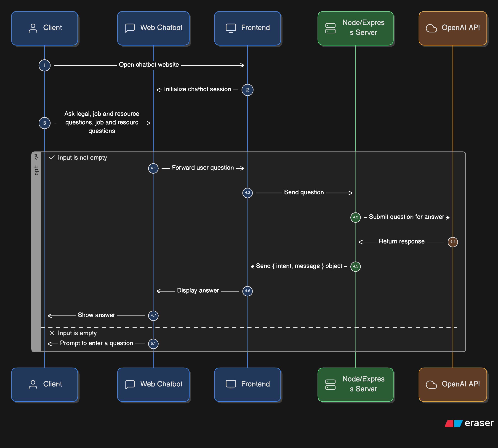

# Hunter Chatbot

A conversational job search assistant that helps users find employment opportunities, legal information, and resources.

## Technologies Used

### Frontend

- [React](https://reactjs.org) - UI library for building component-based interfaces
- [Vite](https://vitejs.dev) - Next-generation frontend tooling
- [TypeScript](https://www.typescriptlang.org) - Typed JavaScript for improved developer experience
- [HeroUI](https://heroui.com) - UI component library for form elements and layout
- [Tailwind CSS](https://tailwindcss.com) - Utility-first CSS framework
- [Axios](https://axios-http.com) - Promise-based HTTP client for API requests

### Backend

- [Node.js](https://nodejs.org) - JavaScript runtime environment
- [Express](https://expressjs.com) - Web framework for Node.js
- [OpenAI API](https://openai.com/api/) - AI language model integration
- [CORS](https://www.npmjs.com/package/cors) - Cross-Origin Resource Sharing middleware

## Project Overview

Hunter Chatbot is designed to assist users in finding job opportunities, legal information, and resources. The application features a conversational interface that understands user queries and provides relevant information from a knowledge base.

### Production Link:
https://hunter-bot-frontend.onrender.com

### Key Features

- Conversational interface for natural language job searching
- Multi-language support (English, Spanish)
- Intent detection to understand user needs
- Knowledge base integration for job listings and resources
- Responsive UI with typing indicators and chat bubbles

## Assumptions and Design Decisions

1. **Knowledge Base Structure**: The system assumes a pre-populated knowledge base with job listings, legal facts, and resources. This data is stored in a structured JSON format.

2. **Language Support**: The application is designed to support multiple languages, with initial implementations for English and Spanish. The system assumes that translations for job titles and descriptions are available in the knowledge base.

3. **User Authentication**: The current implementation does not include user authentication or session management, assuming a single-user context for demonstration purposes.

4. **Stateless Interactions**: Each conversation maintains state only within the client session and is not persisted between sessions.

## Limitations and Future Improvements

1. **OpenAI Model Limitations**: The chatbot uses OpenAI's models which have certain limitations:

   - May occasionally generate responses that don't follow the expected JSON format
   - Limited context window for conversation history
   - Potential for hallucinations or inaccurate information

2. **Knowledge Base Scope**: The current knowledge base is limited to a predefined set of jobs and resources. Future improvements could include:

   - Integration with real-time job databases
   - Dynamic resource updates
   - Geographic filtering and personalization

3. **Performance Considerations**:

   - API calls to OpenAI introduce latency
   - No caching mechanism for frequent queries
   - Limited error recovery for network issues

4. **Accessibility and Inclusion**:
   - Additional language support needed for broader accessibility
   - Screen reader and keyboard navigation improvements required

## Getting Started

### Installation

```bash
# Clone the repository
Frontend:
git clone https://github.com/luisarevalo21/hunter-bot-frontend
Backend:
git clone https://github.com/luisarevalo21/hunter-bot-backend.git

# Install frontend dependencies
cd hunter-chatbot
npm install

# Install backend dependencies
cd backend
npm install
```

## Architecture


